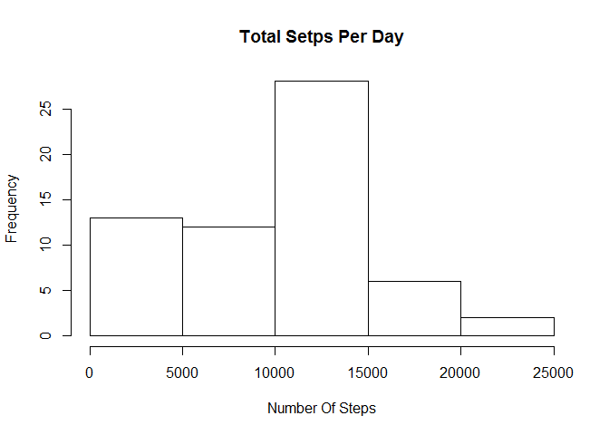
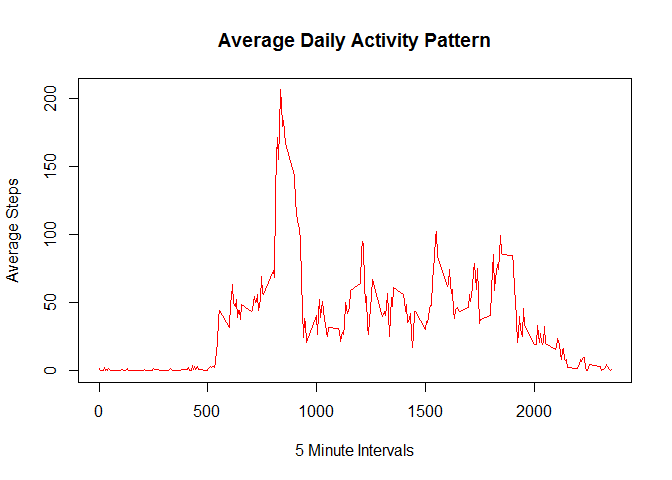
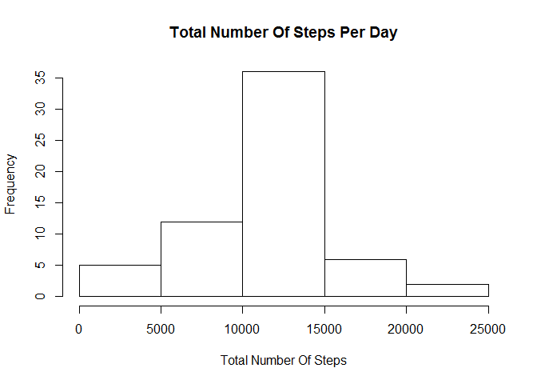
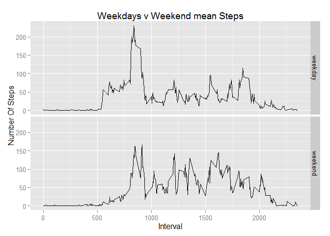

# Reproducible Research: Peer Assessment 1


## Loading and preprocessing the data

Assuming that you have the activity.zip file in your forked repository which serves as your working directory

```r
unzip("activity.zip", exdir = "project_files")
setwd("project_files")
activity_data <- read.csv("activity.csv")
library(dplyr, warn = F) #load dplyr
#A copy of the dat grouped by date
activity_data_by_date <- group_by(activity_data, date)
#Another copy grouped by interval
activity_data_by_interval <- group_by(activity_data, interval)
```


## What is mean total number of steps taken per day?

1. Calculating the total number of steps per day using summarize which will return a data frame that can easily be plotted.

```r
T_steps <- summarize(activity_data_by_date, sum(steps, na.rm = T))
#The second column is of interest
```

2. Creating a histogram of the total number of steps.

```r
#The Breakpoints that I noticed after exploratory analysis seem ok
hist(T_steps[[2]], main = "Total Setps Per Day", 
     xlab = "Number Of Steps")
```

 

3. Reporting Mean and Median of The Total number of steps taken per day

```r
#This will print out immediately
(Daily_mean <- mean(T_steps[[2]]))
```

```
## [1] 9354.23
```

```r
#So will this
(Daily_median <- median(T_steps[[2]]))
```

```
## [1] 10395
```


## What is the average daily activity pattern?
1. Time Plot

```r
day_pat <- summarize(activity_data_by_interval, avg = mean(steps, na.rm = TRUE))
plot(day_pat$interval, day_pat$avg, type = "l", col = "red",
            main = "Average Daily Activity Pattern",
            xlab = "5 Minute Intervals", ylab = "Average Steps")
```

 

2. Reporting which 5-min interval contains max steps

```r
(Int_with_max_steps <- filter(day_pat, avg == max(avg))$interval)
```

```
## [1] 835
```


## Imputing missing values
1. The number of missing values in the data set

```r
(number_of_NA <- length(which(!complete.cases(activity_data))))
```

```
## [1] 2304
```

2. To fill in the missing values I will simply change each NA by the average steps for the interval this NA occurs in. This is convenient since I already calculated the average step for each interval.

3. Creating a New Data Set

```r
#First I will get the indexes where NA occurs.
NA_Ind <- which(!complete.cases(activity_data))
#Now I don't have to create a different data set, I will just recycle the one created on line 51
New_Data_Set <- activity_data
for(i in NA_Ind){
  #Interval corresponding to this index
  tmp_int <- activity_data[i,]$interval
  #The average nber of steps for that interval
  temp <- filter(day_pat, interval == tmp_int)$avg
  #Assign this average to the cell containing NA
  New_Data_Set[i,]$steps <- temp
}
```

4. Histogram, Mean, Median ...

```r
New_Data_Set_bydate <- group_by(New_Data_Set, date)
New_Data_Set_total_bydate <- summarize(New_Data_Set_bydate,
                                       total = sum(steps))
hist(New_Data_Set_total_bydate$total,
     main = "Total Number Of Steps Per Day",
     xlab = "Total Number Of Steps")
```

 

* Reporting Mean and Median of number of steps after filling in for missing values

```r
(mean_total_steps <- mean(New_Data_Set_total_bydate$total))
```

```
## [1] 10766.19
```

```r
(median_total_steps <- median(New_Data_Set_total_bydate$total))
```

```
## [1] 10766.19
```
* These mean and median do slightly differ from what was previously computed. The difference is fairly insignificant however and the histogram plotted is very similar to the one previously plotted. I can conclude that imputing missing data has a non-significant impact on the estimates of the total number of steps.

## Are there differences in activity patterns between weekdays and weekends?
1. Create a set of weekend days

```r
#Friday is not part of the weekend.
weekends <- c("Saturday", "Sunday")
```

* Use the set to create the new variable

```r
#Turn date of New_Data_Set to as.Date
New_Data_Set$date <- as.Date(New_Data_Set$date, "%Y-%m-%d")
#Now mutate
New_Data_Set <- mutate(New_Data_Set, day = as.factor(ifelse(weekdays(date) %in% weekends, "weekend", "weekday"))) %>%
  group_by(day, interval) %>% summarize(avg = mean(steps))
```

2. Time Series Plot

```r
library(ggplot2)
qplot(x = interval, y = avg, data = New_Data_Set, geom = "line",
      facets = day ~ ., main = "Weekdays v Weekend mean Steps",
      xlab = "Interval", ylab = "Number Of Steps")
```

 

There seems to be a difference between the average number of steps taken, averaged across all weekday days or weekend days. There is higher variability amond the weekdays than they are in the weekend days.
